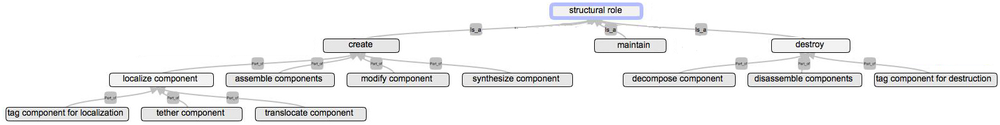
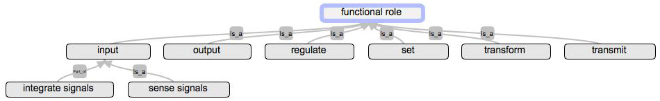

# SyRO
**Sy**stems **R**oles **O**ntology

An OBO compliant ontology for the roles components have in a (biological) system.

SyRO.obo is an [OBO format](http://geneontology.org/faq/what-obo-file-format) file that can be viewed/edited with [OBO-edit](http://wiki.geneontology.org/index.php/OBO-Edit).

## Structural roles

**Structural role:**
A role that relates to establishing or disestablishing the physical existence of a system or maintaining its integrity. (SyRO:0000000)

&nbsp;

## Functional roles

**Functional role:**
A role that relates to the realization of the purpose of the system, i.e. those aspects of its behaviour that are maintained under purifying selection. (SyRO:0000001)

&nbsp;

<!-- [END] -->
